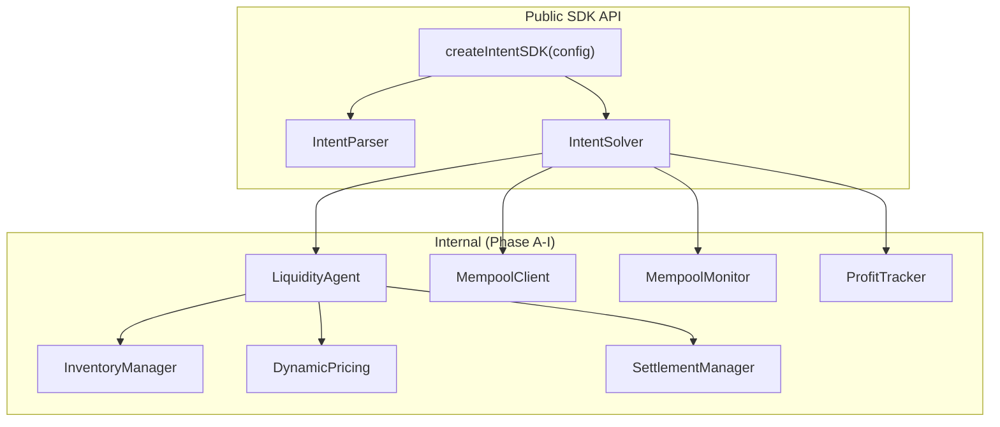

# Phase K: Main Export & Examples — Implementation Plan

## Background

Phase K is the **SDK finalization layer**. It wraps all internal subsystems (LiquidityAgent, Mempool, Inventory, Pricing, etc.) behind a clean, developer-friendly `IntentSolver` class. It also updates the main `src/index.ts` to export everything together, and provides 3 ready-to-run examples.

---

## Architecture



---

## Files to Create/Modify

### 1. [NEW] `src/solver/index.ts` — IntentSolver wrapper

The public-facing class that wraps `LiquidityAgent` + `MempoolMonitor` + `ProfitTracker`.

```typescript
class IntentSolver {
    constructor(config: SolverConfig)

    // Core
    async initialize(): Promise<void>
    solve(intent: SolverIntent): Promise<SolutionResult>
    getQuote(intent: SolverIntent): PricingResult
    canSolve(intent: SolverIntent): boolean

    // Mempool lifecycle
    start(mempoolUrl?: string): void
    stop(): void

    // Status & Monitoring
    getStatus(): AgentStatus
    getStats(): ProfitStats
}
```

> **Design decision:** `IntentSolver` constructs all internal dependencies internally from a single flat `SolverConfig`. The user never touches `InventoryManager`, `DynamicPricing`, etc. directly.

---

### 2. [MODIFY] `src/index.ts` — Main SDK entry point

```diff
- import { IntentParser } from "./parser";
+ import { IntentParser } from "./parser";
+ import { IntentSolver } from "./solver";
+
+ export { IntentParser, IntentSolver };
+ export function createIntentSDK(config) {
+     return { parser: new IntentParser(), solver: new IntentSolver(config) };
+ }
```

---

### 3. [NEW] `examples/basic-bridge.ts`

Demonstrates: Parse a natural language command → get a quote → solve in simulate mode → print fee breakdown.

### 4. [NEW] `examples/autonomous-agent.ts`

Demonstrates: Initialize solver → `start(mempoolUrl)` → auto-process intents from mempool → print profit stats.

### 5. [NEW] `examples/inventory-management.ts`

Demonstrates: Check inventory balances → trigger rebalance check → view profit tracker stats.

---

## Verification Plan

### Automated
```bash
bun test tests/solver/          # All 170+ existing tests must still pass
```

### Manual
- Import `createIntentSDK` from root and verify TypeScript autocomplete works
- Run each example file to confirm no import/type errors
